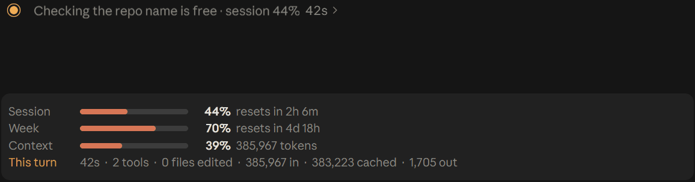
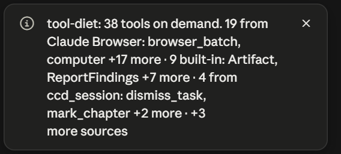
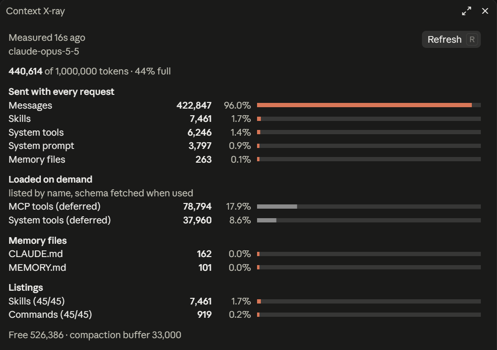

# claude-pro-kit

[](https://github.com/VedantAndhale/claude-pro-kit/actions/workflows/test.yml)

Make the $20 Claude Pro plan last longer in Claude Code.

Twenty-two small [mods](https://code.claude.com/docs/en/plugins/mods/overview) that show you exactly where your usage goes and cut the waste. One mod makes a model call: prompt-polish, once each time you press Improve, and never on its own. The others make none. None adds anything to the system prompt (read-cap adds one tool, which Claude Code lists by name only until Claude first uses it; write-guard adds one line to a tool result at most once per conversation; compact-keeper adds a note of at most 4,000 characters after a compaction): every figure on screen is one Claude Code already reports, or a time the mod measured.

| Mod | What it does | Where |
| --- | --- | --- |
| **tool-diet** | Loads tools you have not used lately on demand instead of with every request | Everywhere |
| **skill-diet** | Lists skills you have not used lately in this project by name only, without their descriptions | Everywhere |
| **agent-diet** | Runs Explore subagents on Haiku instead of your main model | Everywhere |
| **context-xray** | `/xray` opens the exact breakdown of what fills your context window | Everywhere |
| **pro-hud** | Live meters above the prompt for your 5-hour session, your week and the context window, plus a per-turn receipt of tokens in, cached and out | Claude desktop app |
| **output-diet** | Trims long shell output, search results and subagent reports before Claude reads them, keeping the head, the tail and the error lines; the untrimmed text is saved to a file Claude can open without a permission prompt | Everywhere |
| **reread-guard** | Skips Claude re-reading a file it already read when the file has not changed, with `Read` or a plain `cat`, `sed -n`, `head`, `tail` or `Get-Content`; a deliberate retry still goes through | Everywhere |
| **write-guard** | Steers Claude to `Edit` instead of rewriting an existing file in full with `Write`; a deliberate rewrite still goes through | Everywhere |
| **loop-guard** | Holds back a shell command that already failed twice in a row, so Claude changes approach | Everywhere |
| **cmd-diet** | Adds quiet flags to noisy shell commands before they run, so Claude reads short output from the start; errors, failures and warnings stay in full | Everywhere |
| **gh-account** | Runs each git push, pull, fetch, clone and `gh` command as the logged-in GitHub account that can see the repository, without switching the active account | Everywhere |
| **cache-clock** | Counts down until the prompt cache expires; once it has, shows exactly how many tokens your next message will re-send uncached | Everywhere |
| **read-cap** | Stops Claude reading a file over 1,000 lines whole (with `Read`, `cat` or `Get-Content`) and gives it an outline tool, so it reads only the lines it needs; a retry still reads the whole file | Everywhere |
| **session-receipt** | `/receipt` opens a pane with the exact tokens every turn of the session spent, and the costliest turns | Everywhere |
| **peek** | Typing `status` while background tasks run opens a pane with each one's exact elapsed time and last output lines, instead of sending the prompt to Claude | Everywhere |
| **budget-guard** | Holds a prompt back once your 5-hour or weekly usage reaches your limit (90% by default); sending it again goes through | Everywhere |
| **turn-budget** | When one turn uses more than +5 session points, writes a handoff and continues in a fresh session by itself; `/handoff` any time | Everywhere |
| **compact-keeper** | After a compaction, adds a note of exact facts from before it: your latest prompt in full, the todo list, the last failed command, files edited | Everywhere |
| **collision-guard** | Asks before Claude edits a file another chat on this machine changed in the last 30 minutes | Everywhere |
| **answer-pane** | Explain, plan and ELI5 pages drawn natively in a side pane; plans have decision buttons and Respond fills the prompt box | Desktop app (no diagrams in the terminal) |
| **prompt-polish** | An Improve button above the prompt rewrites your draft with Opus at low effort and puts it back in the box; Undo restores it. One model call per press | Everywhere |
| **kit-updates** | Tells you when an installed mod from this kit has a newer version or a new mod joins the kit; `/kit-update` installs updates and new mods | Everywhere |



- With **tool-diet**, every request in a fresh session was **15,954 tokens smaller (−36%)**: 43,859 → 27,905, as the API reported. [Details](#tool-diet).
- With **skill-diet** on top of the other mods, every request in a fresh session was **8,226 tokens smaller (−30%)**: 27,423 → 19,197, as the API reported. [Details](#skill-diet).
- With **agent-diet**, a task that sends one Explore subagent cost **33% less** on a Sonnet session: $0.05570 → $0.03741, averaged over three runs each. [Details](#agent-diet).
- In the [benchmark](#benchmark), a debugging task cost **33% less** with output-diet and reread-guard on, averaged over three runs each.

## Install

In Claude Code:

```
/plugin marketplace add VedantAndhale/claude-pro-kit
/plugin install tool-diet@claude-pro-kit
/plugin install skill-diet@claude-pro-kit
/plugin install agent-diet@claude-pro-kit
/plugin install context-xray@claude-pro-kit
/plugin install pro-hud@claude-pro-kit
/plugin install output-diet@claude-pro-kit
/plugin install reread-guard@claude-pro-kit
/plugin install write-guard@claude-pro-kit
/plugin install loop-guard@claude-pro-kit
/plugin install cmd-diet@claude-pro-kit
/plugin install gh-account@claude-pro-kit
/plugin install cache-clock@claude-pro-kit
/plugin install read-cap@claude-pro-kit
/plugin install session-receipt@claude-pro-kit
/plugin install peek@claude-pro-kit
/plugin install budget-guard@claude-pro-kit
/plugin install turn-budget@claude-pro-kit
/plugin install compact-keeper@claude-pro-kit
/plugin install collision-guard@claude-pro-kit
/plugin install answer-pane@claude-pro-kit
/plugin install prompt-polish@claude-pro-kit
/plugin install kit-updates@claude-pro-kit
```

Updates are off by default for marketplaces you add yourself. With **kit-updates** installed you are told when a fix ships and `/kit-update` installs it, from the desktop app or the terminal. Without it, turn on auto-update once: in a terminal, run `claude`, then `/plugin` → **Marketplaces** → `claude-pro-kit` → **Enable auto-update**; the desktop app has no toggle for it.

Install any one on its own; they do not depend on each other. Mods are not sandboxed, so read the code before installing: each mod is a single file under `plugins/<name>/hooks/`.

## tool-diet

Every tool listed in front sends its whole description and schema with every request. A deferred tool is listed by name only, and Claude loads it through ToolSearch when it needs it; Claude Code already does this for most MCP tools. tool-diet does it for the rest of the tools you are not using: anything outside the core set (Bash, PowerShell, Read, Edit, Write, Glob, Grep, Agent, Skill, ToolSearch, TodoWrite, AskUserQuestion) that you have not used in your last five sessions.

Measured with one prompt, "Reply with just OK.", in a fresh session, as the API reported each request:

| | Prompt tokens per request |
| --- | ---: |
| Without tool-diet | 43,859 |
| With tool-diet | 27,905 |
| **Change** | **−15,954 (−36%)** |

On that setup, the largest tool moved was `Artifact`, whose description alone is 19,870 characters. What moves depends on your tools and your habits; `/xray` shows yours.

- The first time a deferred tool is used in a session costs one extra step, a ToolSearch call. After that it stays loaded for the session.
- Using a tool keeps it loaded for your next five sessions, so the set follows what you actually use.
- The choice is made once per tool per session, so the prompt cache is never disturbed mid-session. Changes apply from the next session.
- `/tool-diet` lists what is on demand this session, grouped by where each tool comes from; `/tool-diet keep <tool>` always loads one, `unkeep` undoes it, and `/tool-diet off|on` switches it. Answers are toasts, so they add nothing to the conversation. The status line keeps the count: `38 tools on demand`.



## skill-diet

Every request carries the skill listing: each installed skill's name and its whole description. With a few plugins installed that is dozens of skills, most of which a given project never uses (video skills in a backend repo, document skills in a game). skill-diet keeps the skills you used lately in this project listed in full and lists the rest on one line by name only. The Skill tool still loads any of them, and typing `/name` still works.

Measured with one prompt, "Reply with just OK.", in a fresh session with 45 skills installed and the other mods on, as the API reported the request:

| | Prompt tokens per request |
| --- | ---: |
| Without skill-diet | 27,423 |
| With skill-diet | 19,197 |
| **Change** | **−8,226 (−30%)** |

In the same setup, asked to fill in a PDF form, Claude found `anthropic-skills:pdf` from its name alone and loaded it with the Skill tool. What moves depends on your skills; `/xray` shows yours.

- A skill used in this project in one of your last five sessions stays listed in full. Every use counts: typed as `/name` or called by Claude through the Skill tool.
- Usage is kept per project folder, so a skill you use in one repo does not crowd the listing in another.
- A skill installed after skill-diet stays listed in full for five sessions, so Claude can find it before you have used it.
- The listing is decided once per session, so the prompt cache is never disturbed mid-session. Changes apply from the next session.
- `/skill-diet` shows what is listed by name only this session and how many characters left the listing; `/skill-diet keep <skill>` always lists one in full, `unkeep` undoes it, and `/skill-diet off|on` switches it. Answers are toasts, so they add nothing to the conversation. The status line keeps the count, in the form `<n> skills by name only, <n> characters off`.
- `/xray` shows the skills line before and after, in tokens.

## agent-diet

A subagent runs on your main model unless its definition or Claude's Agent call names another. Explore only searches and reads, yet in the author's own 85 subagent transcripts, every one of the 2,043 Explore requests ran on Opus or Sonnet, reading 147,298,992 input tokens. agent-diet starts the agent types you list (Explore by default) on Haiku.

- A model Claude names in the Agent call is kept, and a fork always runs on its parent's model.
- Other agent types (general-purpose, Plan, your own) keep their usual model.
- `/agent-diet` shows the setting and how many subagents it moved this session; `/agent-diet model haiku|sonnet|opus` picks the model, `/agent-diet add|remove <agent type>` changes the list, and `/agent-diet off|on` switches it. Answers are toasts, so they add nothing to the conversation. The status line keeps the count, in the form `2 subagents on haiku`.

Measured with `claude -p --model sonnet --output-format json` on a task that sends one Explore subagent to find a file, three runs each in alternating order. Every run found the file. Figures are the cost and tokens Claude Code reported per model:

| Run | Without: cost | Without: Sonnet tokens in | With: cost | With: Sonnet tokens in | With: Haiku tokens in |
| --- | ---: | ---: | ---: | ---: | ---: |
| 1 | $0.05692 | 68,395 | $0.03724 | 40,213 | 27,848 |
| 2 | $0.05577 | 68,111 | $0.03764 | 39,593 | 27,872 |
| 3 | $0.05441 | 68,123 | $0.03736 | 40,184 | 42,770 |
| Average | $0.05570 | | $0.03741 | | |

## context-xray



`/xray` opens a pane with the exact breakdown `/context` computes: what is sent with every request (system prompt, tools, MCP tools, memory files, skills, messages), what is loaded on demand, which MCP tools load every time, and each memory file's size. It measures when the pane opens and when you press Refresh (or `r`), never in the background, because the exact count sends one token-count request per tool and memory file.

**Opens by itself** when the context crosses 60% and again at 80%, with a toast pointing at `/compact` and `/handoff`. `/xray auto off` keeps it to `/xray` only.

## pro-hud

The recording at the top of this page is the band. In text:

```
Session    ━━━━━━━━━━━━━━──────   69%  resets in 32m
Week       ━━━━━━━━━━━━━━━─────   74%  resets in 4d 17h
Context    ━━━━━━━━────────────   44%  436,034 tokens
This turn  1m 35s · 1 tool · 0 files edited · 436,034 in · 431,260 cached · 580 out
```

On a wide window the three meters sit side by side on one row; on a narrow one each figure on the turn line wraps whole rather than being cut off.

- **Session / Week**: the share of your plan's 5-hour and 7-day allowance used, and when each resets. Account-wide: every chat and device counts.
- **Context**: how full this conversation is. Every request resends it, so a fuller context spends your session faster; `/compact` when it climbs.
- **This turn / Last turn**: updates live while Claude works (per tool call and per model request), then shows the turn's final figures and how many points of your session it used.
- The spinner gains `· session 20%`, and finished tool calls draw as one line: status dot, tool, target, time.
- A toast when the session crosses 80% and 90%.

`/hud` shows what is on; `/hud all on|off`, or `/hud band|spinner|cards on|off`. The answer is a toast, so toggling adds nothing to the conversation. It draws in the desktop app only and leaves the terminal as it is. Rows other mods put above the prompt, such as prompt-polish's Improve row, still draw beneath the band.

**Weekly toasts** at 50%, 75% and 90% of the week, once each, because the weekly limit drains quietly across many sessions.

## output-diet

When a `Bash` or `PowerShell` result runs past 120 lines or 8,000 characters, Claude reads:

```
[output-diet: 82/500 lines shown; all 500 in ~/.claude/projects/<project>/<session>/tool-results/output-diet-<call>.txt]

<first 30 lines>
… [lines 31–450 omitted; error/warning lines from them:]
   250│ ERROR: build failed in src/app.ts
   300│ Warning: deprecated API
…
<last 50 lines>
```

- You still see the output in the transcript as before; only Claude's copy is trimmed.
- The status line keeps a running count: `3 trimmed · 41,200 chars saved`.
- The untrimmed text is written to disk first; if the write fails, nothing is trimmed.
- It goes in the session's own `tool-results` folder, beside the transcript, where Claude Code keeps the outputs it saves itself, so Claude can open it without a permission prompt. When that folder cannot be found, it goes under `~/.claude/output-diet/` (or `CLAUDE_CONFIG_DIR`).
- A `Grep` result past the same limits keeps its first 100 lines, with a note to narrow the search: `[output-diet: first 100/252 lines shown; narrow the search, or read all in …]`. In the author's 1,048 past Grep results, 26 went past the limits, and keeping the first 100 lines would have cut 104,052 characters. `Glob` is left alone: none of 128 went past.
- A subagent's report past 8,000 characters keeps its first 6,000 and last 2,000 characters, so the opening and the conclusion stay. In the author's 123 past reports, 17 went past it, 313,365 characters between them.
- Claude Code itself already cuts the middle out of very long shell output (past roughly 10,000 characters) before any mod sees it, and for a failing command no uncut copy is kept. output-diet works on what is left: the saved file holds everything Claude would have read, and an error line Claude Code cut is not in it.

## reread-guard

When Claude asks to `Read` the same range of the same file again in the same conversation, and the file's size and modification time have not changed, the read is skipped and Claude is told to use the copy it has. Any edit, a different range, or a subagent (which has its own context) reads freely. Claude Code can clear old tool results from context, so retrying the identical read straight after a skip always goes through. The record resets on `/compact` and `/clear`.

What Claude is told in place of the repeat read, kept to one line because the model reads it:

```
api.ts unchanged since you read it; use that copy. If it's gone from context, retry the same Read.
```

**Shell reads too.** Claude often reads a file with the shell instead of `Read`: in the author's transcripts, 318 `sed -n` runs went past the guard. A shell command that only prints one file is now treated the same way: `cat FILE`, `sed -n 'A,Bp' FILE`, `head -n N` / `tail -n N`, and in PowerShell `Get-Content`, `gc`, `cat` or `type` (with `-TotalCount`, `-Head`, `-First`, `-Tail`, `-Last` or `-Raw`). The same range of the same unchanged file is skipped once, and retrying the same command goes through. A whole `cat` after a whole `Read` that showed every line counts as a repeat. A pipe, a chain, a variable, a glob or any other flag runs untouched. A shell read never counts as a `Read`, since `Edit` needs a real one first.

The status line counts them: `2 re-reads skipped`.

## write-guard

`Write` sends the whole file as Claude's output, the most expensive kind of token; `Edit` sends only the lines that change. Claude sometimes rewrites a file it has already read in full to change a few lines. In the author's own 272 session transcripts, 141 writes rewrote a file Claude had already read or written (999,273 characters), and 112 of them followed an earlier rewrite in the same session. Of the 512,847 characters in the rewrites whose previous version was in the transcript, 171,325 had changed.

A hook runs after Claude has written the content, so write-guard cannot save the rewrite it sees; it stops the ones after it:

- The first rewrite of an existing file in a conversation goes through, with one line for Claude after the result: `You rewrote all of api.ts. For changes to an existing file use Edit: it sends only the changed lines.`
- A later rewrite is held back once, and Claude is told: `api.ts exists; change it with Edit, not a full Write. If a full rewrite is intended, retry the same Write.` Retrying the same Write goes through.
- New files, and files under 2,048 bytes, are never touched. A subagent has its own conversation and its own first rewrite; a compaction or `/clear` starts over.
- The status line counts them: `1 full rewrite held back`.

## loop-guard

Each retry of a failing command re-sends the whole conversation, and the same command usually fails the same way. In the author's 272 session transcripts, 10 commands failed 3 or more times, 38 runs between them.

Once the exact same `Bash` or `PowerShell` command has failed twice in a row, the next try is held back once, and Claude is told:

```
This exact command failed 2 times in a row. Change the approach instead of rerunning it. If a rerun is intended, retry the same command.
```

- Retrying the same command straight after the hold goes through, for a command that is meant to be rerun.
- A success clears the count, and each command is counted on its own. A subagent counts its own commands; a compaction or `/clear` starts over.
- The status line counts them: `1 failing retry held back`.

## cmd-diet

output-diet trims long output after a command has run; cmd-diet keeps the noise from being printed at all. Before a `Bash` or `PowerShell` command runs, a known noisy command gets its own quiet flags, which drop progress lines and keep errors, test failures and warnings:

| Command | Runs as | Output, measured |
| --- | --- | --- |
| `git status` | `git status --short --branch` | 415 to 58 characters |
| `pytest` | `pytest -q` | 1,063 to 495 characters, failure details unchanged |
| `cargo build` / `test` / `check` / `clippy` / `run` | `cargo build -q` | 197 to 0 characters on success, warnings unchanged |
| `npm install` / `ci` | `npm install --no-audit --no-fund` | 62 to 18 characters |
| `curl` (Bash only) | `curl -sS` | 1,049 to 577 characters, the progress meter removed |
| `mvn` | `mvn -B -ntp` | not measured: drops download progress |
| `wget` (Bash only) | `wget -nv` | not measured: one line per file |
| `docker pull` | `docker pull -q` | not measured: drops layer progress |

In a live headless run (`git status && python -m pytest` on 41 test files, one failing), the request cost 41,535 tokens without cmd-diet and 40,571 with it, by the API's `usage`, and both runs named the failing test and its reason correctly. The shorter output stays in context, so every later request in the session sends less too.

- Each step of a `&&`, `||` or `;` chain is handled on its own. A step that pipes, redirects or substitutes (`| grep`, `> file`, `$(...)`) is left alone, since something else reads its output; `2>&1` is fine.
- A command that already sets its output level (`git status --porcelain`, `pytest -v`, `curl -fsSL`, `npm install --silent`) is left alone, and a flag already present is not added twice.
- If a tool rejects a flag (an old version), that rule stops for the session and Claude's retry runs the command as typed.
- The status line counts them: `3 commands quieted`.

## gh-account

With two GitHub accounts logged in to `gh`, a push to a repository the other account owns fails, and Claude spends turns on `gh auth status` and `gh auth switch`. Before a `Bash` or `PowerShell` command runs, gh-account matches each `git push`, `pull`, `fetch`, `clone`, `ls-remote` and `gh` step to the repository's owner, and the owner to a logged-in account. When that account is not gh's active one, that step alone runs with its token:

```
GH_TOKEN="$(gh auth token --user ACCOUNT)" git push
```

The token itself never appears in the command or its output, and the active account is not switched. For git it also asks `gh` for the credential.

- The owner comes from a URL in the command, `-R owner/repo`, a `gh api repos/<owner>/...` path, or the folder's remotes. With no remote named, every remote must point at the same owner.
- The account is the one whose login is the owner, else the one account that is a member of that organization. The accounts come from `gh auth status`, and organizations from `gh api user/orgs`. What it learns is kept across sessions.
- Nothing is guessed: no owner, more than one matching account, or anything unclear leaves the command as typed. It also leaves alone `gh auth` and other `gh` commands that reach no repository, a command that already sets `GH_TOKEN`, a token from the environment, git over ssh, hosts other than github.com, and subshells or substitutions.
- `/gh-account` shows which account each owner uses, and `/gh-account forget` clears it. Answers are toasts. The status line counts them: `2 commands sent as <account>`.

## cache-clock

Claude's prompt cache keeps your conversation for a fixed time after each request. Reply within it and the context is read from cache; reply after it and the whole context is sent again at full price. That message pays the cache-write price (1.25 times the input price for a 5-minute cache, 2 times for a 1-hour one) on every token instead of the cache-read price (0.1 times): 12.5 to 20 times more for the same context, and nothing on screen says so.

cache-clock puts the countdown in the status line, restarted by every response from the main conversation:

```
cache warm · 3m left
cache cold · next message re-sends 61,204 tokens
```

When the cache runs out, a toast says so once (after the lifetime is known, see below). The token figure is the previous response's input, cache and output tokens as the API reported them, which is exactly what the next request sends. After a message that did go out uncached, a dim transcript line confirms the real figure:

```
cache-clock: cache expired after 7m 12s idle; this message re-sent 61,204 tokens uncached.
```

Claude Code does not report the cache's lifetime on a turn, so cache-clock learns it. Until it knows, it assumes 5 minutes, says `≥3m left` and `likely cold`, and shows no toast, since on a 1-hour cache a 5-minute alarm would be false. The first cache hit after more than 5 minutes idle proves a 1-hour cache, and a miss proves 5 minutes; the answer is kept across sessions. Subagents have their own cache and do not move the clock.

**Warns once before the cache expires:** 5 minutes before a 1-hour cache ends, 1 minute before a 5-minute one, and only when the context is big enough (20,000+ tokens) for the miss to matter. Until the cache's real lifetime is learned, it stays quiet.

## read-cap

When Claude asks to `Read` a text file of more than 1,000 lines with no line range, the read is refused once, with the exact line count, and Claude is pointed at the outline tool:

```
big.ts has 3,000 lines. Call mcp__read-cap__outline to see its definitions with line numbers, then Read only the range you need (offset, limit). Retry the same Read to read it whole anyway.
```

The outline tool lists a file's functions, classes, types and Markdown headings with their line numbers. It is built from the file on disk with no model call, and covers JavaScript, TypeScript, Python, Go, Rust, Java, C#, Kotlin, Swift and Markdown. In a live run on a 3,000-line file, Claude called the outline, then read the 10 lines it needed instead of the whole file. Retrying the same whole-file Read always goes through, ranged reads, images and PDFs are never touched, and the status line counts the reads capped.

A plain shell read of the whole file is held once the same way: `cat FILE` in Bash, or `Get-Content`, `gc`, `cat` or `type` in PowerShell, and Claude is told to retry the same command to read it whole. A `Read` and a shell read of the same file share the one hold. A ranged print (`sed -n`, `head`, `tail`) and anything else pass.

## session-receipt

`/receipt` opens a pane listing every turn of the session with the tokens its requests reported, main thread and subagents together:

```
#3  61,000 new · 50,000 cached · 2,000 out (8,500 subagents) · 3 tools · 42s
```

`new` is input the prompt cache did not serve (uncached input plus cache writes) and `out` is output; both are full price. `cached` is input read from the cache, at a tenth of the price. The pane opens with the session totals and the five turns that spent the most new and output tokens, each with the first line of its prompt, so you can see which requests made a session expensive. Opening it adds nothing to the conversation, and `/clear` starts a fresh receipt.

**After an expensive turn** (3 or more points of the 5-hour session), a toast names it: `Turn 14 used 4 points of your session (1,204,000 new tokens in, …)`. The points are Claude Code's own readings before and after the turn.

## peek

Asking Claude how a background task is going re-sends the whole conversation. In the author's transcripts, "status" was typed 24 times in 4 sessions, and those 24 requests re-sent 15,377,344 tokens in total.

When you type `status` (trimmed, any case) while background shell tasks or subagents run, peek drops the prompt, so it is never sent to Claude, says `peek: 2 running, opened in the pane`, and opens a pane instead:

```
2 running

shell  npm run build  ·  4m 12s
  [##########----------] 52%  as reported by the task's output
  src/app.ts compiled
  src/db.ts compiled
  src/ui.ts compiled

subagent  Find the config loader  ·  1m 3s
  Explore · running
```

- Each task shows its type, its command or description, an exact elapsed timer that counts up while the pane is open, and the last 3 lines of its output.
- The bar is drawn only when the task's own output prints a percent. Nothing is estimated.
- Tasks that finished in the last 10 minutes are listed below, with how they ended.
- With nothing running, `status` goes to Claude as normal. `/peek` opens the same pane at any time.
- No model calls. Opening the pane adds nothing to the conversation.

## budget-guard

Before a prompt starts a turn, budget-guard checks the 5-hour and weekly usage readings Claude Code reports (the same exact percentages pro-hud shows). If either is at or over your limit, the prompt is held back and you are told why:

```
budget-guard: 5-hour usage at 93%, resets in 1h 12m (your limit is 90%). Send the same message again to go ahead, or /budget off.
```

Sending the same message again goes through, so nothing is ever blocked for good. `/budget` shows the limit and the current readings, `/budget 80` sets the limit (kept across sessions), and `/budget on|off` switches it. Until Claude Code has reported a reading in the session, nothing is held.

## turn-budget

budget-guard looks at your session before a turn starts. turn-budget watches one turn while it runs, because a long agentic turn can quietly use a big share of your session between two of your messages. It checks before each model request in a turn, subagents' included.

**At the limit, it hands off to a fresh session by itself** (the default):

1. The turn stops before the next request. A running command is never cut off.
2. It writes a handoff from exact session data, with no model call: your last prompts (the latest in full, with its line breaks; earlier ones shortened), the todo list, the files Claude edited, `git status --short`, `git diff --stat`, and the last thing Claude said. It's saved under `~/.claude/handoffs/`.
3. It clears the chat and sends the handoff as the first message of the fresh session, so Claude carries on with a few thousand tokens of context instead of re-sending the whole old conversation on every request.
4. A toast tells you it happened. The old conversation stays in `/resume`.

The handoff never touches your repository: it is saved outside it, under `~/.claude/handoffs/`, and git is only read (`git status --short`, `git diff --stat`), never written to. Nothing is staged, committed or added to your project.

`/handoff` does the same at any time.

Limits, whichever comes first: **+5 points** of the 5-hour session, or **500,000 uncached input tokens** for when the session meter lags behind. Cache reads aren't counted. Without a subscription there's no session reading, so only the token limit applies.

Prefer to decide each time? `/turn-budget ask` shows a question at the limit instead:

```
This turn has used 6 points of your session (20% → 26%, limit +5) over 14 requests. Keep going?
  Hand off to a fresh session · Continue · Don't ask again · Stop here
```

**Stop here** ends the turn and leaves Claude one line saying you stopped it. Anything but a clear Continue counts as Stop. A question nobody can answer (a `-p` run) never stops a turn.

`/turn-budget` shows the settings, `/turn-budget 8` sets the points, `/turn-budget tokens 1000000` the token limit, `/turn-budget handoff|ask` what happens at the limit, and `/turn-budget off|on` switches it. Answers are toasts. While a turn runs, the status line reads `turn budget 3/5 pts`.

## compact-keeper

A compaction replaces the conversation with a model-written summary, which can drop or paraphrase what matters most. The author's sessions hold 63 compaction summaries.

After each compaction of the main conversation, compact-keeper appends a note under the summary, titled `Kept exactly (compact-keeper)`. It is built from the session on your machine, with no model call:

- your latest prompt in full, plus up to 4 earlier ones, each cut at 600 characters
- the todo list, with each item's status
- the last failed shell command, with its exit code
- the files edited this session, with how many edits each

The note is capped at 4,000 characters, and the oldest prompts are dropped first; the latest prompt is cut only if it alone is over the cap. It tells Claude to trust these facts where the summary differs. A subagent's own compaction is left alone, and `/clear` starts over.

A toast gives the exact counts, in the form `compact-keeper kept <n> prompts, <n> files, <n> todos, the last failed command (<n> chars)`. `/compact-keeper` opens the last note in a pane.

What it costs: the note adds up to 4,000 characters to every request after a compaction.

## collision-guard

Two Claude chats working in the same folder can edit the same file without knowing about each other. Before Claude edits a file (Edit, MultiEdit, Write, NotebookEdit), collision-guard checks whether another chat on this machine changed that file in the last 30 minutes, and asks first:

```
README.md was changed by another chat 4 min ago (chat 7dc9d8a1 in mods). Edit it anyway?
  Proceed · Proceed for this file · Cancel
```

- **Proceed** lets this edit through and asks again next time. **Proceed for this file** stops asking about this file until the other chat changes it again. **Cancel** refuses the edit and tells Claude, in one line, to re-read the file and ask you how to proceed.
- If something else changed the file after the other chat did (you in an editor, say), the question says "modified since".
- Each chat records its own edits in its own small file under `~/.claude/collision-guard/`, so two chats never write the same file. Records older than the window are skipped without being read. The same file spelled differently (`D:/x` and `d:\x`) counts as one.
- It only sees edits made through Claude's edit tools: a file changed by a shell command (`sed`, a formatter, `git checkout`) isn't recorded. It only knows about chats that have the mod. A chat in its own git worktree has its own copy of the files, so it never clashes.
- Zero tokens unless you press Cancel. No model calls, no network. A question nobody can answer (a `-p` run) lets the edit through.
- `/collisions` lists the files other chats changed here recently, `/collisions 15` sets the window in minutes, `/collisions off|on` switches it. Answers are toasts. The status line reads `1 other chat active here` while another chat is editing in the same folder.

## answer-pane

Three kinds of page in one side pane, drawn natively: panel cards, diagrams, tables, callouts, timelines, trees and bars, in the app's own light or dark look. It follows [Andrej Karpathy's post](https://x.com/karpathy/status/2105819303471976479) on reading model output: clear writing, then diagrams, then pages.

| Kind | Ask with | What you get |
| --- | --- | --- |
| **Explain** | Any question with linked ideas, a process, or a comparison (Claude picks a page on its own) | A one-page explainer with diagrams |
| **Plan** | `/plan-page <what to build>` | The plan as parts, with 2–5 decisions as buttons. Strike parts, comment on them, then **Respond** (`r`) puts your answer in the prompt box. Nothing is sent until you press Enter, and Claude builds only after you do. |
| **ELI5** | `/eli5 <topic>` | Big pictures, few words, no jargon |

The plan and ELI5 kinds follow Anthropic's `html-plan` and `eli5` skills from [claude-plugins-community](https://github.com/anthropics/claude-plugins-community).

- **Writing check:** pages are checked against "80% of ASD-STE100" (Karpathy's tip). Long, passive or vague sentences go back to Claude to fix once. `/pages style off|80|strict` changes it.
- **In a plan, a decision you don't touch is reported as "not answered; default kept"**, not as agreement. Comments reach Claude quoted, as feedback, never as instructions.
- `/pages` lists this session's pages. **Browser** (`o`) opens the full page if you want it; you never need to. Pages are saved under `~/.claude/answer-pane/`. Needs Node.js 20 or newer. The terminal shows everything except diagrams, which it names.
- The bundled renderer in `vendor/` is MIT-licensed; its license is in `vendor/`.

What it costs per request, measured with `claude -p "Reply with just OK."`:

| | Prompt tokens |
| --- | ---: |
| Without answer-pane | 27,260 |
| With answer-pane (default): Claude can choose a page on its own | 27,837 (+577) |
| `/pages auto off`: pages only when you ask | +174 |

The mod makes no model calls: the draft is Claude's answer, and drawing happens on your machine.

## prompt-polish

This is the one mod in the kit that makes a model call, and only when you press it.

A row above the prompt box shows **[Improve]**, and **[Undo]** after a rewrite. `ctrl+x tab` focuses the row; then `i` improves, `u` undoes, and `c` cancels a call in progress. `/polish <prompt>` does the same from a command. The row stays up while Claude works, so you can polish the next prompt as you type it. In the terminal it shows only while the box holds a draft.

Improve sends the draft to Opus at low effort with a bundled copy of the [prompt-master](https://github.com/nidhinjs/prompt-master) rules by nidhinjs (MIT; its license is in `LICENSE-prompt-master`), and puts the rewrite back in the box. It never sends it: you read it, edit it, or press Undo to get your original back.

- Drafts under 5 words are not sent; a toast says so.
- File paths, code, commands, names, URLs and exact numbers are kept word for word, and the model is told not to add requirements the draft does not state.
- If you type over the draft while the model runs, your newer words win and the rewrite is dropped.
- A toast shows the call's exact tokens as the API reported them.

`/polish model haiku|sonnet|opus` picks the model; the toast names the one used. One measured press on Opus at low effort: 13,790 input tokens and 73 output tokens, answered in 2.2 s. Most of the input is the prompt-master rules. These calls count toward your plan's usage limits like any other request on that model; Haiku is the cheaper choice if you press often.

## kit-updates

At the start of each session it downloads this repo's `marketplace.json` (about 2 KB, from GitHub) and compares it with the versions in your `installed_plugins.json`. When an installed mod is behind, a toast and a dim transcript line say so, with exact versions:

```
claude-pro-kit: 2 updates available (pro-hud 0.2.1 → 0.2.2, tool-diet 0.1.2 → 0.1.3). Run /kit-update.
```

Updates to the mods you have installed **install by themselves** at session start (`/kit-update auto off` to only announce them). `/kit-update` runs the same thing now: `claude plugin marketplace update claude-pro-kit`, then `claude plugin update` for each outdated mod and `claude plugin install` for each kit mod you never had. It reads the versions from the refreshed marketplace, not the GitHub file, whose copy can lag a push by a few minutes. Restart Claude Code to load the new versions. Nothing is sent to the model, and it stays silent when everything is current or GitHub cannot be reached. When a new mod joins the kit, it says so once, with the install command; mods already in the kit when you installed kit-updates are not announced. To have new mods install themselves instead, run `/kit-update auto-new on` (off by default); a mod you uninstalled is never put back.

## Benchmark

One task, three runs without the mods and three with, Claude Opus 5.5, as Claude Code reported each run:

| | Input tokens | Output tokens | Cost | Turns |
| --- | ---: | ---: | ---: | ---: |
| Without mods | 262,301 · 325,766 · 170,377 | 865 · 1,043 · 679 | $0.2137 · $0.3698 · $0.1890 | 8 · 8 · 6 |
| With mods | 237,823 · 196,700 · 234,067 | 1,302 · 1,084 · 1,152 | $0.1799 · $0.1636 · $0.1702 | 8 · 7 · 7 |
| **Mean change** | **−12%** (252,815 → 222,863) | +37% (862 → 1,179) | **−33%** ($0.2575 → $0.1713) | same (7.3) |

Every run with the mods cost less than every run without them, and every run fixed the bug. Claude wrote somewhat more with the mods on, and spent much less on context. Token counts vary a lot from run to run because Claude takes a different path each time, so read this as one task's result, not a promise. Cost is the API-equivalent figure `claude -p` reports; on a Pro plan it is a proxy for how fast the session meter moves. reread-guard had nothing to skip in this task, so the difference is output-diet's.

`bench/run.sh` runs one task twice through `claude -p`, without and then with the mods, each in a fresh copy of `bench/fixture`: run an 800-line test suite, find the one failure, fix it, re-run. It prints the tokens in, cached and out that Claude Code reports for each run. Both runs leave your user settings out, so the mods are the only difference. Each run spends plan usage.

```
bash bench/run.sh        # one run per side
bash bench/run.sh 3      # three per side
```

## Develop

Each mod is a plugin folder under `plugins/`. To run them from a checkout, list the folders in `CLAUDE_CODE_PLUGIN_DIRS` (`;` between paths on Windows, `:` elsewhere), in your shell or in the `env` block of `~/.claude/settings.json`, and restart Claude Code.

```
claude plugin validate plugins/pro-hud
claude plugin test plugins/pro-hud
```

Installed copies update only when a plugin's version changes, so bump `version` in its `plugin.json` (and its entry in `.claude-plugin/marketplace.json`) with every change you ship.

## License

MIT
